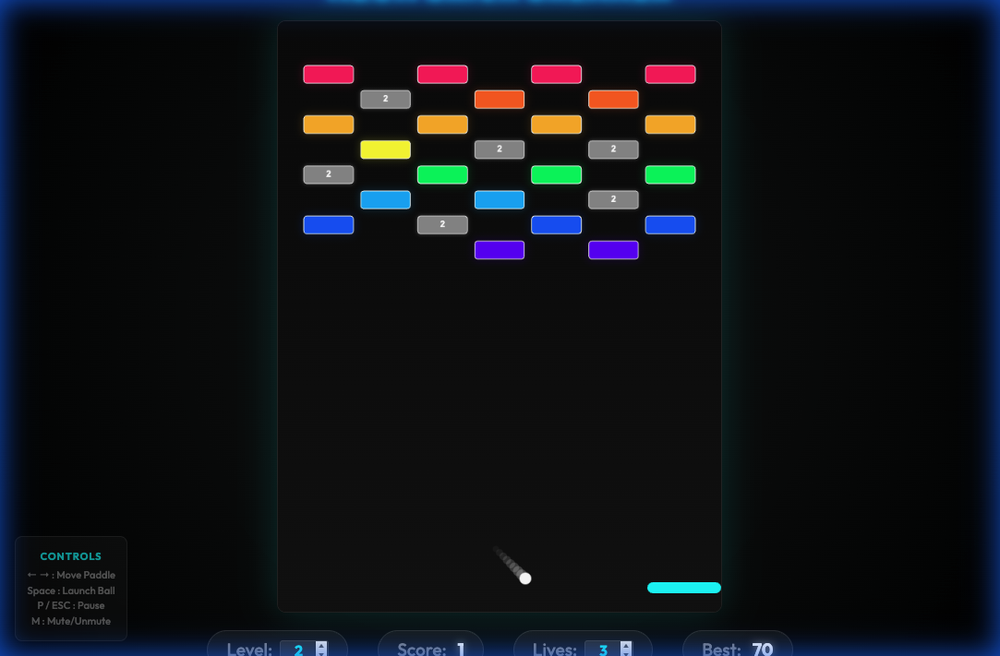

# Neon Brick Breaker 🧱✨

[](https://lastjung.github.io/brick_breaker/)

A stylish, neon-themed Brick Breaker game created by Gemini 3 Pro and Antigravity.



## Installation & Running 🛠️

To play the game locally, follow these steps:

1.  **Clone the Repository**:
    ```bash
    git clone https://github.com/lastjung/brick_breaker.git
    ```
2.  **Open the Game**:
    - Navigate to the project directory.
    - Open `index.html` in any modern web browser.
    - *Alternatively*, use a local server (like VS Code Live Server) for the best experience.

## Update History 📅

- **v1.5 (Latest)**:
  - **Enhanced UI Readability**: Redesigned **Level** and **Lives** inputs with interactive neon styling, making it easier for players to discover and use these features.
  - **Visual Showcase**: Added high-quality gameplay screenshots to the documentation.
- **v1.4**:
  - **Infinite Level System**: Added 10 unique hand-crafted level patterns.
  - **Procedural Generation**: Implemented a seed-based generator for levels 11 and beyond, ensuring endless variety.
- **v1.3**:
  - Added **Space bar restart** functionality from Game Over/Victory screens.
  - Implemented **Mute/Unmute** logic with keyboard shortcut (`M`).
  - Added **Pause** system (`P` or `Esc`).
  - Improved **Paddle Physics**: Added acceleration and friction for smooth movement.
  - Added **Controls Guide** UI for desktop users.
  - Fixed **Web Audio API** autoplay issues.
  - Subtle background **pulse animation** for enhanced neon atmosphere.
- **v1.2**: Added special bricks (Steel, Explosive, Moving) and power-ups.
- **v1.1**: Implemented particle systems and screen shake.
- **v1.0**: Initial release with core gameplay and mobile optimization.

## Key Features 🚀

### 1. Interactive Game Settings
- **Direct Level Selection**: Players can manually set their starting level by clicking the **Level** input in the HUD. Discover 10 unique patterns and infinite procedural levels!
- **Customizable Lives**: Set your own challenge by adjusting the starting lives before beginning.
- **Real-time Performance Metrics**: Track your Score and personal Best directly on the HUD.

### 2. Stunning Neon Design
- Features vibrant neon colors and glow effects for a modern, sleek visual experience.
- High-contrast dark mode design reduces eye strain and enhances immersion.

### 3. Full Mobile Optimization (iOS/Android)
- **Thick Mobile Paddle**: The paddle automatically expands to 40px on mobile screens (below 1280px) for better touch control.
- **Viewport Locking**: Prevents screen scrolling or bouncing, providing a native-app-like feel.
- **Responsive Layout**: Automatically hides non-essential UI (like control panels) to maximize the game area on smaller screens.

### 4. Procedural Audio with Web Audio API
- **Dynamic Sound Synthesis**: Instead of using static audio files, the game generates sound in real-time using the **Web Audio API OscillatorNode**.
- **Real-time Envelopes**: Implements `exponentialRampToValueAtTime` to create smooth volume decays (gain envelopes), mirroring the feel of classic 8-bit hardware.
- **Context Management**: Features an intelligent `SoundManager` that handles browser autoplay policies, ensuring audio context resumption only upon user interaction.
- **Unique Timbre Mapping**: Uses different waveforms (Sine, Square, Triangle, Sawtooth) to distinguish between hits, wall bounces, and level progression.

### 5. Custom Settings & Infinite Levels
- **Slider Controls**: Adjust ball speed and paddle movement speed in real-time during gameplay.
- **Endless Patterns**: Diverse brick patterns like checkerboards, pyramids, and columns appear as you progress.

## Controls 🎮

### Basic
- **Start / Launch / Restart**: Click the screen or press the `Space` key.
- **Paddle Movement**:
  - **PC**: Move the mouse or use keyboard arrow keys (`←`, `→`).
  - **Mobile**: Touch and swipe near the paddle.

### Shortcuts
- **P / Esc**: Pause / Resume the game.
- **M**: Mute / Unmute sound.
- **Mouse Capture Mode**: Click the 'Capture Mouse' button to lock your cursor for more precise control. (Press `Esc` to release.)

## Tech Stack 🛠

- **Structure**: HTML5 Semantic Elements
- **Styling**: CSS3 (Flexbox, Grid, Animations, Glassmorphism)
- **Logic**: Vanilla JavaScript
- **Graphics**: HTML5 Canvas API
- **Audio**: Web Audio API (Dynamic Oscillators)

---
*This project was developed with the support of AI Pair Programming from Google DeepMind.*
